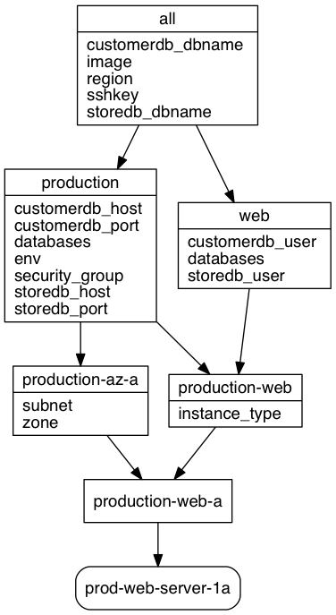

## Summary
ansible-inventory-grapher creates a dot file suitable for use by
graphviz

Requires:
* a sensible Ansible setup (PYTHONPATH must include the Ansible libs)
* graphviz

## Getting started
```bash
pip install ansible-inventory-grapher
```

## Usage
```
Usage: ansible-inventory-grapher [options] pattern1 [pattern2...]

Options:
  --version             show program's version number and exit
  -h, --help            show this help message and exit
  -i INVENTORY          specify inventory host file [/etc/ansible/hosts]
  -d DIRECTORY          Location to output resulting files [current directory]
  -o FORMAT, --format=FORMAT
                        python format string to name output files (e.g.
                        {}.dot) [defaults to stdout]
  -q, --no-variables    Turn off variable display in default template
  -t TEMPLATE           path to jinja2 template used for creating output
  -T                    print default template
  -a ATTRIBUTES         include top-level graphviz attributes from
                        http://www.graphviz.org/doc/info/attrs.html
                        [rankdir=TB;]
  --ask-vault-pass      prompt for vault password
  --vault-password-file=VAULT_PASSWORD_FILE
                        Location of file with cleartext vault password
```

Using the example inventory in https://github.com/willthames/ansible-ec2-example,
we can generate the dot files for two of the example web servers using:
```bash
bin/ansible-inventory-grapher -i ../ansible-ec2-example/inventory/hosts \
  prod-web-server-78a prod-web-server-28a \
  -d test --format "test-{hostname}.dot"
```

## Customization

You can generate different types of graph by using the `-a` option to insert a string with graphviz attributes (http://www.graphviz.org/doc/info/attrs.html) to apply to the root level of the graph.  Some fun examples:
```bash
# transpose the tree so it grows from left-right instead of top-bottom
-a "rankdir=LR;"

# circular layout, with group nodes shaded grey
-a "layout=circo; overlap=false; splines=polyline;\
  node [ style=filled fillcolor=lightgrey ]"

# OCD
-a "rankdir=LR; splines=ortho; ranksep=2;\
  node [ width=5 style=filled fillcolor=lightgrey ];\
  edge [ dir=back arrowtail=empty ];"
```

You can replace the entire default template (which can be seen by passing the
`-T` variable to `ansible-inventory-grapher`) with a template file
that can be passed with the `-t` option.
```bash
cat << EOF > html_table_nodes.dot.j2
digraph {{pattern|labelescape}} {
  {{ attributes }}


  {{ node.name|labelescape }} [shape=record
  {{- " style=rounded" if node.leaf }} label=<
<table border="0" cellborder="0">
  <tr><td  href="ssh://{{ node.name|labelescape }}" >
  <b><font face="Times New Roman, Bold" point-size="16">
  {{ node.name }}
  </font></b></td></tr>

  <hr/><tr><td><font face="Times New Roman, Bold" point-size="14">

  {{var}}<br/>

  </font></td></tr>

</table>
>]




  {{ edge.source|labelescape }} -> {{ edge.target|labelescape }};

}
EOF

bin/ansible-inventory-grapher -t html_table_nodes.dot.j2 -i ./test/inventory/hosts all > all.dot \
  && dot -Tsvg all.dot > all.svg
```

as an aside, SVG output can be nice, since you can open it in a
browser to search and copy/paste text, as well as activate link URLs
to open your nodes in ssh: (as in the sample above) or embed links to
those nodes / groups in your monitoring site.

## Render Pipeline

The resulting graphs can then be converted to pngs using:
```bash
for f in test/*.dot ; do dot -Tpng -o test/`basename $f .dot`.png $f; done
```



Or the whole thing can now be done in one pipeline (only works for one pattern) 
straight to image viewer (imagemagick's display in this example)
```bash
bin/ansible-inventory-grapher -i ../ansible-ec2-example/inventory/hosts \
  prod-web-server-1a | dot -Tpng | display png:-
```

This works with valid Ansible patterns now although only hosts and groups have been tested.
